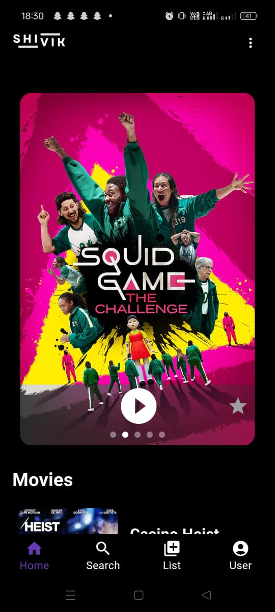
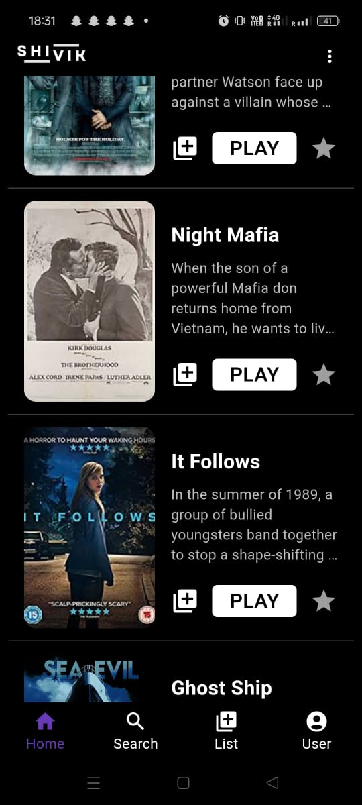
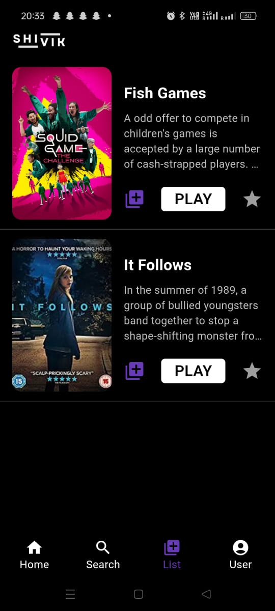
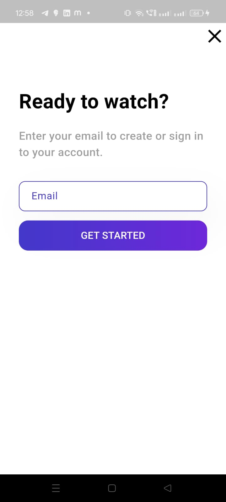
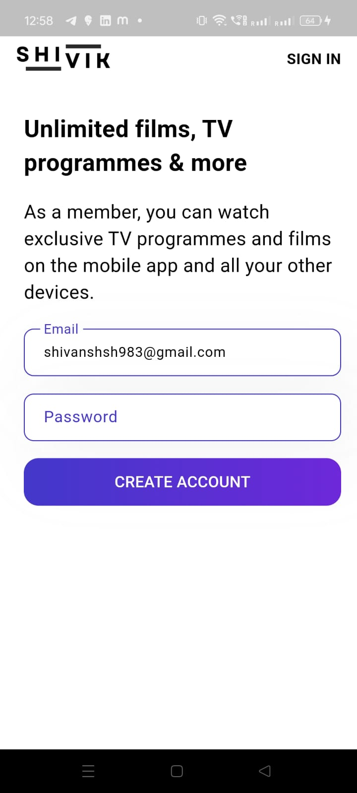
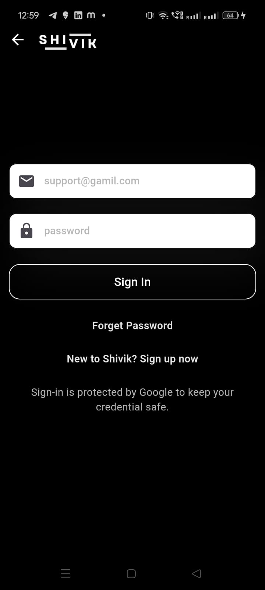
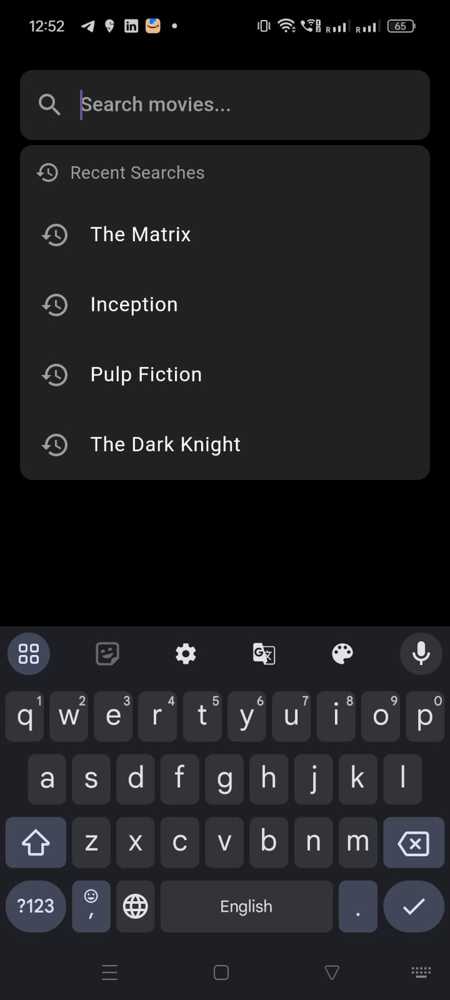
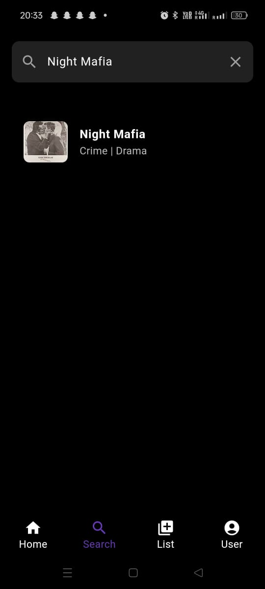
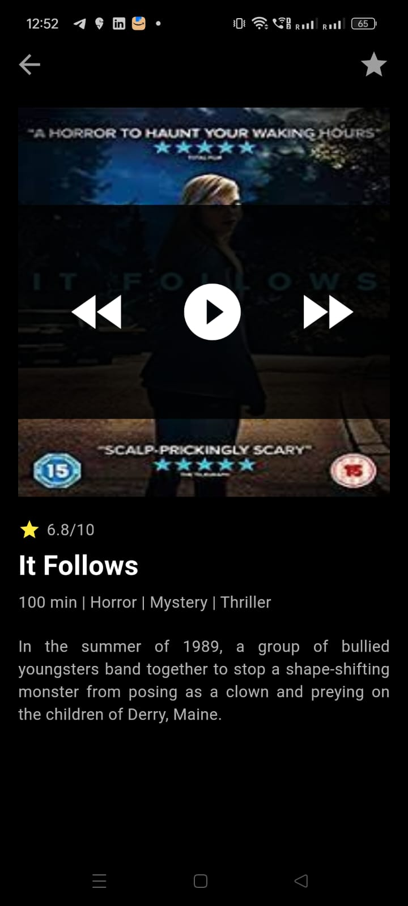
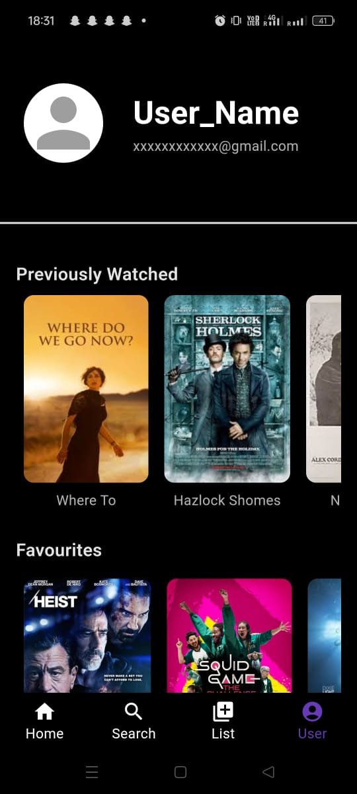

# 🎬 Movie App (Flutter)
# SHIVIK

Movie Streaming App with inbuild recommendation system.

A feature-rich **Flutter movie application** with Firebase authentication, search functionality, movie playback, and user history tracking.

## 📌 Features

- **Home Page**: Displays a list of available movies
- **Search Page**: Search movies by title or genre
- **Movie Detail Page**: View details of selected movies
- **Watch Page**: Stream movies within the app
- **User Page**: Displays user details and profile
- **Addlist Page**: Add movies in your Playlist
- **Favorites List**: Save and view favorite movies
- **Previously Watched List**: Keep track of watch history

## 🚀 Tech Stack

- **Flutter** (Dart)
- **Data Structures** (List to store favourite/watched movies)

## 📸 Screenshots

### 🔹 Splash Screen  

### 🔹 Onborading

### 🔹 Home Screen  

### 🔹 Addlist Screen 

<!--### 🔹 SignUp Screen  

### 🔹 Password Screen  

### 🔹 SignIn Screen  
-->

### 🔹 Search Screen  

### 🔹 Movie Details Page 

### 🔹 Watch Page 

### 🔹 User Page 

